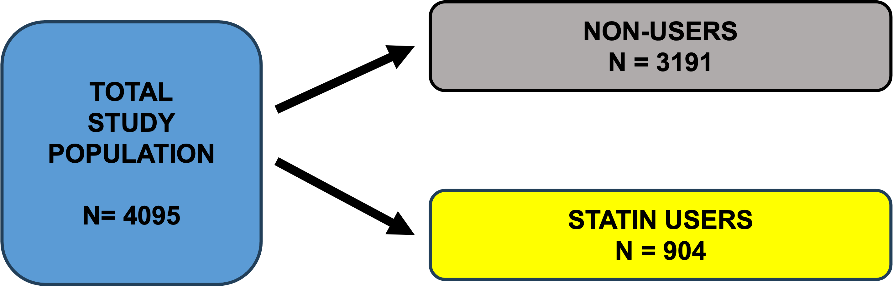

# TITLE

The study leverages openly accessible data, available on DRYAD (<https://datadryad.org/stash/dataset/doi:10.5061/dryad.6qs53>), that are part of the third survey of the Prevention of REnal and Vascular ENd-stage Disease (PREVEND). This observational study evaluated the association between statin use and cognitive function in a large population with more than 10-year follow-up on statin use. Additionally, it sought to determine if the duration of treatment impacted this association.

A total of 4095 patients were collected, with 904 (22%) being statin users and 3191 (78%) being non-users. The total duration of treatment in years was also assessed for statin users.



The **Ruff Figural Fluency Test (RFFT)** score was used as the primary outcome measure for cognitive function.

Baseline data about demographis, clinical characteristics and medical history were collected for each patient. In particular, the covariates that were taken into consideration for the following analyses were:

-   Gender (Male/Female)
-   Educational level (≤ 12 years, \>12 years)
-   History of vascular events (CVD) (Yes/No)
-   Hypertension (Yes/No)
-   Diabetes Mellitus (DM) (Yes/No)
-   Smoking status (Yes/No)
-   Albuminuria levels (\<30 mg/24hr, ≥30 mg/24hr)
-   Age (in years)
-   Body Mass Index (BMI, in kg/m2)

## Libraries

Import the libraries necessary for the analysis

```{r}
library()
```

